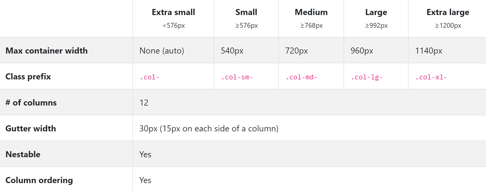

class: dark middle center

# Bootstrap 
> Build responsive, mobile-first projects on the web with the world's most popular front-end component library. 

---
class: dark
### Workshop
# Bootstrap

During this workshop you'll learn the ins-and-outs of the component library Bootstrap by following these slides **sequentially**.

On regular intervals there will be a slide with a white background and a subtitle **Workshop**. This is a **call-to-action** where you'll have to:
- Practise what you've learned in the slides
- Research the documentation of Bootstrap 
- Code the requested website

> The documentation is located [here](https://getbootstrap.com/docs/4.1/getting-started/introduction)


---
### Workshop
# Preview

The end result of this workshop is available online.

**Act**:
- Visit the website by following [this link](https://webapplicaties1.github.io/10thBootstrap/)
- Click through multiple pages
- Resize the browser to see the responsiveness

---
class: dark 
### Presentation
# Behind the scenes
This presentation is created using [Remark.js](https://remarkjs.com/) and uses [Bootstrap](https://getbootstrap.com/) internally. The slides are **interactive**, which means that you can click on elements just as Bootstrap would show them on your website. 

When you reach the chapter about **The Grid** make sure to resize the browser window from time-to-time, you'll see Bootstrap in action.

Guidelines
- **These Items** are crucial parts of the slide
- [These Items](/) are links to other websites, try clicking them
- `These Items` are codeblocks
> These items are remarks

---
class: dark
### Codebase
# Behind the scenes

Repositories
- [Workshop Starter](https://github.com/WEBAPPLICATIES1/10thBootstrap)
- [Workshop Solution](https://github.com/WEBAPPLICATIES1/10thBootstrap/tree/solution/exercise)
- [Workshop Slides](https://github.com/WEBAPPLICATIES1/10slBootstrap)

File downloads
- [Workshop Starter](https://github.com/WEBAPPLICATIES1/10thBootstrap/archive/master.zip)
- [Workshop Solution](https://github.com/WEBAPPLICATIES1/10thBootstrap/archive/solution.zip)

---


class: dark middle center

# Bootstrap
### Introduction

---

class: dark
### Introduction
# Bootstrap

Bootstrap is a **mobile-first** **front-end** library for faster and easier web development. It includes `HTML` and `CSS` based design templates for creating **common user interface components** like:
- forms
- buttons 
- navigations
- dropdowns
- alerts
- ...

When using a component library like bootstrap you'll have to write **a lot less `.(s)css` code**.

> Some examples can be [seen here](https://getbootstrap.com/docs/4.1/examples).

---

class: dark

### Introduction
# Bootstrap

Why should I use Bootstrap?
- Responsive, mobile-first
- Compatible with all **modern** web browsers
- A descent look and feel
- Fast and scalable
- Consistent interface
- Easily adjustable
- Numerous examples
- Integrates with content management systems
- Write less boilerplate `.(s)css` code

---
class: dark
### Getting the bits
# Bootstrap

There are multiple ways to use Bootstrap in your project:
- Compiled CSS and JS Files
    - **Out-of-the-box** `.css` and `.js` files you can download and import.
    - This does **not** include dependencies nor documentation.
- Source files
    - This option requires some additional tooling, since you'll have to **compile** the source code.
- Content Delivery Network (CDN)
    - Skip the download and directly add a link to the BootstrapCDN to deliver cached version of Bootstrap’s **compiled CSS and JS** to your project.
    - This does **not** include dependencies nor documentation.
- Package managers
    - See Web ApplicationsII

---

class: dark
### Using the CDN
# Getting the bits

As previously stated there are multiple ways to use Bootstrap in your website. In the example, we'll be using the Content Delivery Network(CDN).

Advantages of using the CDN:
- If the user visited **a** site where bootstrap was included using the CDN, the **load time** of bootstrap on your site is **drastically decreased** since the files are **cached** in the browser's memory.
- The files are **not stored in your project**.
- Bootstrap takes care of **minimizing the files**, thus creating a smaller footprint.
- **Updating** to a newer version of bootstrap is just a replacement of the references `links` tags, in your html document(s).

---

class: dark

### Getting the bits
# Starter Template

To start using bootstrap, you can copy-paste the starter template from the [official website](https://getbootstrap.com/docs/4.1/getting-started/introduction/#starter-template).

Basically the template is noting more than a `HTML` page with `link` and optional `script` tags.


> Note the usage of the `link`- and `script` tags. These references are importing Bootstrap on your page(s).

> The usage of the `script` tags are optional, but are mandatory for many components. 

---
class: dark
```html
<!doctype html>
<html lang="en">
<head>
    <!-- Required meta tags -->
    <meta charset="utf-8">
    <meta name="viewport" 
        content="width=device-width, initial-scale=1, shrink-to-fit=no">
    <!-- Bootstrap CSS, can be on disk or CDN -->
*   <link rel="stylesheet" href="link-to-bootstrap.min.css">
    <title>Bootstrap Starter!</title>
</head>
<body>
    <h1>Hello, world!</h1>

    <!-- Optional JavaScript -->
    <!-- jQuery first, then Popper.js, then Bootstrap JS -->
*    <script src="link-to-jquery.min.js"></script>
*    <script src="link-to-popper.min.js"></script>
*    <script src="link-to-bootstrap.min.js"></script>
</body>
</html>
```
> `link` and `script` tags were adjusted for display reasons.

---

### Workshop
# Starting with Bootstrap
Learning to setup Bootstrap from scratch.

**Act:**
- Open Visual Studio Code
- Download the starter files from [here](https://github.com/WEBAPPLICATIES1/10thBootstrap/archive/master.zip)
- Unzip the folder
- In the **exercise** folder Create a new **index.html** file
- Copy the [starter template](https://getbootstrap.com/docs/4.1/getting-started/introduction/#starter-template) from the bootstrap website into **index.html**
    - During the workshop we'll be using the CDN option
- What is the purpose of the following attributes of the `script` tag?
    - `crossorigin="anonymous"`
    - `integrity="sh384-..."`

> You won't see a big difference on the page since we haven't used any components yet.

---
class: dark middle center

# Bootstrap
### Behind the scenes
 
---

class: dark

### Behind the scenes
# Bootstrap

Interally Bootstrap uses:
- **S**yntactically **A**wesome **S**tyle**S**heets
    - Bootstrap 4.0+ (used to be **LESS**)
- **J**ava**S**cript
- Various Fonts
- Reboot
    - Resetting the browser's default styles
- Additional JS Libraries:
    - Popper.js
    - jQuery.js

> Deep Dive: [Why bootstrap 4 means sass has won](https://developer.telerik.com/featured/why-bootstrap-4-means-sass-has-won/)

---
class: dark

### Behind the scenes
# JavaScript

Many of Bootstrap's components require the use of **JavaScript** to function. Specifically, they require [jQuery](https://jquery.com/), [Popper.js](https://popper.js.org/), and their own JavaScript plugins. If you want to use these components, you'll have to add `script` links to your html pages. 

Note that:
- `script` tags are added as the last elements of the `body` element
- jQuery **must** come first
- then Popper.js
- and then optional JavaScript plugins.

> In the [starter template](https://getbootstrap.com/docs/4.0/getting-started/introduction/#starter-template) these scripts are provided by default.

> Deep Dive: [Why put script tags at the bottom of the page?](http://stevesouders.com/hpws/move-scripts.php)

---

class: dark
### Behind the scenes
# Reboot

For improved **cross-browser rendering**, Bootstrap uses **Reboot** to correct inconsistencies across browsers and devices while providing slightly more opinionated resets to common HTML elements. In previous chapters we used a **reset-styles.css** to become the same behavior.

> Deep Dive Reboot                  
Reboot builds upon **Normalize**, providing many HTML elements with somewhat opinionated styles using only element selectors. Additional styling is done only with classes. For example, Bootstrap reboots some `<table>` styles for a simpler baseline and later provides classes like `.table, .table-bordered`.

---

class: dark
### Behind the scenes
# Customizing bootstrap

Since `.css` works with the **last-in-wins** principle, including your own stylesheet after bootstrap's will **override** the built-in styles.

```html
<!-- index.html -->
<head>
    <link rel="stylesheet" href="link-to-bootstrap.css">
    <link rel="stylesheet" href="/styles/`your-stylesheet.css`">
</head>
```

In `your-stylesheet.css` you have to use the **exact same selector** for the element you want to override. 

```scss
// your-stylesheet.css
.btn-primary {
    background: beige; //Bootstrap has a class called `.btn-primary`
}
```

> `your-stylesheet.css` can be generated by using SASS.

---
class: dark middle center

# Bootstrap
### Layout
 
---
class: dark
### Layout
# Mobile First

Bootstrap uses the mobile first approach. Therefore it's important to use the `viewport` meta tag. So the pages scale correctly while zooming on mobile devices.

```html
<head>
    ...
    <meta name="`viewport`" 
        content="width=device-width, initial-scale=1, shrink-to-fit=no">
    ...
</head>
```
> Deep Dive: [Mobile First - What Does It Mean?](https://www.uxmatters.com/mt/archives/2012/03/mobile-first-what-does-it-mean.php)

---
class: dark
### Layout
# Breakpoints
Bootstrap primarily uses the following media query ranges to adjust the layout, grid system, and components for different screen sizes.

```css
// Extra small devices (portrait phones, less than 576px)
// No media query for `xs` since this is the default in Bootstrap

// Small devices (landscape phones, 576px and up)
@media (min-width: 576px) { ... }

// Medium devices (tablets, 768px and up)
@media (min-width: 768px) { ... }

// Large devices (desktops, 992px and up)
@media (min-width: 992px) { ... }

// Extra large devices (large desktops, 1200px and up)
@media (min-width: 1200px) { ... }
```

> Take a look at the [documentation](https://getbootstrap.com/docs/4.1/layout/overview/#responsive-breakpoints)

---
class: dark
### Layout
# Container

Containers are the most basic layout element in Bootstrap and are **required when using the default grid system**.

Use a responsive, fixed-width `.container` when the max-width has to change at each breakpoint.

```html
<div class="container">
  <!-- Content here -->
</div>
```
Use `.container-fluid` for a full width container, spanning the entire width of the viewport.

```html
<div class="container-fluid">
  <!-- Content here -->
</div>
```
> Take a look at the [documentation](https://getbootstrap.com/docs/4.1/layout/overview/#containers)

---
### Workshop
# Containers 
Learning the difference between `.container` and `.container-fluid`.

**Act:**
- Open the **index.html** file
    - Remove the `h1` element in the `body`
    - Add a `fixed-width` container in the `body`
        - Give the `div` element an `id` attribute of `main-container`
        - Add a `paragraph` with the text "My Container" in the container

> If you forgot the difference between **fixed-width** and **fluid** go back a few slides.

---
### Workshop
# Containers
**Act:**
- Paste the following block of code in the `<head>` element
```html
    <style>
        #main-container{
            background: red;
        }
    </style>
```
- Open the website via Google Chrome
    - You should see a red container with the text "My Container"
    - Resize the browser window from mobile to desktop size
        - See how the **fixed-width** container behaves

> Inline CSS is considered an **anti-pattern** in real projects.
---

### Workshop
# Containers
**Act:**
- Open the **index.html** file 
    - Change the `fixed-width` `container` to a `fluid` one
- Open the website via Google Chrome
    - Resize the browser window from mobile to desktop size
        - See how the `fluid` container behaves
- Open the **index.html** file 
    - Change the `fluid` `container` back to a `fixed-width` one
- Remove the `paragraph` from the `container`
- Remove all the code in the `<style>` element located in the `<head>`
- Remove the `id` attribute from the container.

---
class: dark
### Layout
# Grid
Bootstrap’s grid system uses a series of containers, rows, and columns to layout and align content. It’s built with [flexbox](https://developer.mozilla.org/en-US/docs/Web/CSS/CSS_Flexible_Box_Layout/Basic_Concepts_of_Flexbox) and is fully responsive. 

- The grid is **always** a child of a `.container(-fluid)`
- The grid has **1 or more rows**
- A column is **always** a child of a `.row`
- Content **must** be placed within a `.col`
- Only columns may be **immediate children of rows**
- Per Row there can only be a **maximum of 12 colums**
- Column classes indicate the **number of columns** you’d like to use
- You can use predefined grid classes (like `.col` or `.col-2`)

> Tip - The grid system is very similar to an HTML table structure

> `table` > `tr` > `td` is like `.container` > `.row` > `.col`

---
class: dark
### Layout
# Grid
The following shows the Bootstrap Grid system as a tree structure. You should **never** set content outside a `.col`. 

- `.container`
    - `.row`
        - `.col`
            - Your Content
        - `.col`
            - Your Content
        - ... Additional Columns (Max. 12)
    - `.row`
        - `.col`
            - Your Content
    - ... Additional Rows (Unlimited)

---
class: dark
### Layout
# Grid
Below is an example of how the grid comes together in code.
```html
<div class="`container`">
  <div class="`row`">
    <div class="`col`">
      One of three columns
    </div>
    <div class="`col`">
      One of three columns
    </div>
    <div class="`col`">
      One of three columns
    </div>
  </div>
</div>
```
> The above example creates three equal-width `columns` using the predefined grid classes. Those columns are centered on the page within the parent `.container`.

---
class: dark
### Layout
# Grid Columns
Utilize column classes .col-**n** for easy column sizing without additional HTML elements. Just like a `colspan` in an HTML `table`.

```html
    <div class="row">
        <div class="col">col</div>
        <div class="col">col</div>
        <div class="col">col</div>
        <div class="col">col</div>
    </div>
    <div class="row">
        <div class="`col-8`">col-8</div>
        <div class="`col-4`">col-4</div>
    </div>
```
<div class="bootstrap">
    <div class="container">
        <div class="row">
            <div class="col border">col</div>
            <div class="col border">col</div>
            <div class="col border">col</div>
            <div class="col border">col</div>
        </div>
        <div class="row">
            <div class="col-8 border">col-8</div>
            <div class="col-4 border">col-4</div>
        </div>
    </div>
</div>
<br>

---
### Layout
# Stacked to horizontal

A handheld device is not capable of showing all the content horizontally, therefore the content is **stacked** vertically. However a desktop's screen is large enough to show the content **horizontally**. To tackle this responsive issue, Bootstrap’s grid includes five tiers of **predefined classes** for building complex responsive layouts. 

---

class: dark
### Layout
# Stacked to horizontal
Customize the size of your columns on extra small, small, medium, large, or extra large screens however you see fit by using the built in classes.
```html
.col-`breakpoint`-`colsize`
```

Breakpoints:
- sm
- md
- lg
- xl

colsizes:
- 1 to 12

---
class: dark
### Layout
# Stacked to horizontal
Using a single set of `.col-sm-*` classes, you can create a grid system that starts out **stacked** and becomes **horizontal** at the small breakpoint (**sm**).

```html
<div class="row">
  <div class="col-`sm`-8">col-sm-8</div>
  <div class="col-`sm`-4">col-sm-4</div>
</div>
<div class="row">
  <div class="col-`sm`">col-sm</div>
  <div class="col-`sm`">col-sm</div>
  <div class="col-`sm`">col-sm</div>
</div>
```
<div class="bootstrap">
    <div class="container">
        <div class="row">
            <div class="col-sm-8 border">col-sm-8</div>
            <div class="col-sm-4 border">col-sm-4</div>
        </div>
        <div class="row">
            <div class="col-sm border">col-sm</div>
            <div class="col-sm border">col-sm</div>
            <div class="col-sm border">col-sm</div>
        </div>
    </div>
</div>
<br/>

> Resize this browser window to a phone-size.

---
### Layout
# Stacked to horizontal


---
class:dark

### Layout
# Mix and Match
Don’t want your columns to simply stack in some grid tiers? Use a combination of different classes for each tier as needed. 

> Each class **scales up**, so if you wish to set the same widths for `xs and sm`, you **only** need to specify `xs`.


```html
<div class="row">
  <div class="`col-sm-6 col-md-10`">.col-sm-6 .col-md-10</div>
  <div class="`col-sm-6 col-md-2`">.col-sm-6 .col-md-2</div>
</div>
```
<div class="bootstrap">
    <div class="container-fluid">
        <div class="row">
            <div class="col-sm-6 col-md-10 border">.col-sm-6 .col-md-10</div>
            <div class="col-sm-6 col-md-2 border">.col-sm-6 .col-md-2</div>
        </div>
    </div>
</div>
<br/>

> Resize this browser window to a phone-size.

---
class:dark
### Layout
# Mix and Match
```html
In this example, cols are always 50.00% (`6`) wide, on mobile and desktop
<div class="row">
  <div class="col-`6`">.col-6</div>
  <div class="col-`6`">.col-6</div>
</div>
```

<div class="bootstrap">
    <div class="container-fluid">
        <div class="row">
            <div class="col-6 border">.col-6</div>
            <div class="col-6 border">.col-6</div>
        </div>
    </div>
</div>
<br/>

> Resize this browser window to a phone-size.

---

### Workshop
# Stacked to horizontal
Learn how bootstrap rearanges the grid based on the screen size.

**Act:**
- Navigate to [this]( https://www.w3schools.com/bootstrap/bootstrap_grid_examples.asp) website.
    - Look at the code examples and try them out (green buttons)
    - You'll have to resize your browser window quite often

> If you have a smartphone, navigate to the aforementioned website  and try out the examples. The pages will adjust themself due to Bootstrap's grid system.

---
class: dark
### Layout
# Offset Columns
Move columns to the right using `.offset-md-*` classes. These classes increase the left margin of a column by `*` columns. For example, `.offset-md-4` moves `.col-md-4` over four columns.

<div class="bootstrap">
    <div class="container-fluid">
        <div class="row">
            <div class="col-md-4 border">.col-md-4</div>
            <div class="col-md-4 offset-md-4 border">.col-md-4 .offset-md-4</div>
        </div>
        <div class="row">
            <div class="col-md-3 offset-md-3 border">.col-md-3 .offset-md-3</div>
            <div class="col-md-3 offset-md-3 border">.col-md-3 .offset-md-3</div>
        </div>
        <div class="row">
            <div class="col-md-6 offset-md-3 border">.col-md-6 .offset-md-3</div>
        </div>
    </div>
</div>
<br/>

> Resize this browser window to a phone-size.

---
class: dark
### Layout
# Offset Columns
The code example from the previous slide.
```html
<div class="row">
  <div class="col-md-4">.col-md-4</div>
  <div class="col-md-4 `offset-md-4`">.col-md-4 .offset-md-4</div>
</div>
<div class="row">
  <div class="col-md-3 `offset-md-3`">.col-md-3 .offset-md-3</div>
  <div class="col-md-3 `offset-md-3`">.col-md-3 .offset-md-3</div>
</div>
<div class="row">
  <div class="col-md-6 `offset-md-3`">.col-md-6 .offset-md-3</div>
</div>
```


---
class: dark middle center

# Bootstrap
### Utilities

---
class:dark
### Utilities
# Overview

Bootstrap provides multiple utilities for example:
- [Colors](https://getbootstrap.com/docs/4.1/utilities/colors/)
    - Primary Secondary, Success, Danger, ... 
- [Display](https://getbootstrap.com/docs/4.1/utilities/display/)
    - Hide an element when on mobile
- [Flex](https://getbootstrap.com/docs/4.1/utilities/flex/)
    - Classes to help with Flexbox
- [Position](https://getbootstrap.com/docs/4.1/utilities/position/)
    - static, sticky,...
- ...

> Take a look at the [documentation](https://getbootstrap.com/docs/4.1/utilities/)
> note that there are many utilities but some are more important than others.

---
class:dark
### Utilities
# Colors

Bootstrap comes with a default set of colors, note that these can be overriden.
<div class="bootstrap">
    <div class="container-fluid">
        <div class="row border">
            <div class="col-sm bg-primary ">primary</div>
            <div class="col-sm bg-secondary ">secondary</div>
            <div class="col-sm bg-success ">success</div>
            <div class="col-sm bg-danger ">danger</div>
        </div>
        <div class="row border">
            <div class="col-sm bg-warning ">warning</div>
            <div class="col-sm bg-info">info</div>
            <div class="col-sm bg-light text-dark ">light</div>
            <div class="col-sm bg-dark ">dark</div>
        </div>
        <div class="row border">
            <div class="col-sm-12 text-center">...</div>
        </div>
    </div>
</div>

<br/>

> Take a look at the [documentation](https://getbootstrap.com/docs/4.1/utilities/colors/)

---
### Workshop
# Colors
Learn how to use the default colors in Bootstrap. 
But please make sure to read the documentation first, the docs can be found [here](https://getbootstrap.com/docs/4.1/utilities/colors/). You don't have to write any `css`, the result can be achieved by using Bootstrap classes.

**Act**
- Open the `index.html` file
- Copy the following code in the `.container` div element:
```html
<div>first div</div>
<div>second div</div>
<div>third div</div>
```
- Give the first `div` a `.dark` background and a yellow text color
- Give the second `div` a `.success` background and a white text color
- Give the third `div` a `.danger` background and dark text color

Result:
<div class="bootstrap">
    <div class="container">
        <div class="row w-75">
            <div class="col-sm bg-dark text-warning">first div</div>
            <div class="col-sm bg-success text-white">second div</div>
            <div class="col-sm bg-danger text-dark">third div</div>
        </div>
    </div>
</div>  
---
class:dark
### Utilities
# Display
For faster mobile-friendly development, use responsive **display** classes for **showing and hiding** elements by screen size.. 

To hide elements simply use the `.d-none` class or one of the `.d-{sm,md,lg,xl}-none` classes for any responsive screen variation.

To show an element only on a given interval of screen sizes you can combine one `.d-*-none` class with a `.d-*-* `class, for example `.d-none .d-md-block .d-xl-none` will hide the element for all screen sizes except on medium and large devices.

```html
<div class="`d-lg-none`">hide on screens wider than lg</div>
<div class="`d-none` `d-lg-block`">hide on screens smaller than lg</div>
```

<div class="bootstrap">
    <div class="container">
        <div class="d-lg-none bg-info">hide on screens wider than lg</div>
        <div class="d-none d-lg-block bg-primary">hide on screens smaller than lg</div>
      </div>
</div>   

> Avoid creating entirely different versions of the same site, instead hide element responsively for each screen size.

> Resize this browser window to a phone-size.

---
class:dark
### Utilities
# Display Classes
<table width=100%>
  <thead>
    <tr>
      <td>Screen Size</th>
      <td>Class</th>
    </tr>
  </thead>
  <tbody>
    <tr>
      <td>Hidden on all</td>
      <td>.d-none</td>
    </tr>
    <tr>
      <td>Hidden only on xs</td>
      <td>.d-none .d-sm-block</td>
    </tr>
    <tr>
      <td>Hidden only on sm</td>
      <td>.d-sm-none .d-md-block</td>
    </tr>
    <tr>
      <td>Hidden only on md</td>
      <td>.d-md-none .d-lg-block</td>
    </tr>
    <tr>
      <td>Hidden only on lg</td>
      <td>.d-lg-none .d-xl-block</td>
    </tr>
    <tr>
      <td>Hidden only on xl</td>
      <td>.d-xl-none</td>
    </tr>
    <tr>
      <td>Visible on all</td>
      <td>.d-block</td>
    </tr>
    <tr>
      <td>Visible only on xs</td>
      <td>.d-block .d-sm-none</td>
    </tr>
    <tr>
      <td>Visible only on sm</td>
      <td>.d-none .d-sm-block .d-md-none</td>
    </tr>
    <tr>
      <td>Visible only on md</td>
      <td>.d-none .d-md-block .d-lg-none</td>
    </tr>
    <tr>
      <td>Visible only on lg</td>
      <td>.d-none .d-lg-block .d-xl-none</td>
    </tr>
    <tr>
      <td>Visible only on xl</td>
      <td>.d-none .d-xl-block</td>
    </tr>
  </tbody>
</table>
<br>
> This slide is not interactive, else it would be quite confusing.

---
### Workshop
# Display
Learn how to show and hide elements based on the display classes.

**Act**
- Open the `index.html` file
- In the `.container` div element, you'll have three divs from the last exercise:
```html
<div class="bg-dark text-warning">first div</div>
<div class="bg-success text-white">second div</div>
<div class="bg-danger text-dark">third div</div>
```
- Hide the first `div` on every screen size
- Hide the second `div` on `sm` screens, but show it on all others (also `xs`)
- Hide the third `div` on screens smaller than `lg` screens
- Resize the browser window to see your changes
- Eventually remove the **three** `div` elements

> The result can be seen on the following slide.

---
### Workshop
# Display
Result from the previous slide.

<div class="bg-dark text-warning d-none">first div</div>
<div class="bg-success text-white d-sm-none d-md-block">second div</div>
<div class="bg-danger text-dark d-none d-lg-block">third div</div>

<br/>
> Note that the first `div` is not showing.

> Resize the browser from small to large

---
class: dark middle center
# Bootstrap
### Components

---
class: dark 
### Components
# Overview
There are many Bootstrap components, the entire list can be found [here](https://getbootstrap.com/docs/4.1/component). In the workshop we'll use the following:
- [Nav](https://getbootstrap.com/docs/4.1/components/navs/)
- [Navbar](https://getbootstrap.com/docs/4.1/components/navbar/)
- [Jumbotron](https://getbootstrap.com/docs/4.1/components/jumbotron/)
- [List Group](https://getbootstrap.com/docs/4.1/components/list-group/)
- [Cards](https://getbootstrap.com/docs/4.1/components/card/)
- [Tables](https://getbootstrap.com/docs/4.1/content/tables/)
- [Forms](https://getbootstrap.com/docs/4.1/components/forms/)
- ...
---
class: dark
### Components
# Nav
The base `.nav` component is built with **flexbox** and provide a strong foundation for building all types of navigation components. 
```html
<ul class="`nav`">
  <li class="`nav-item`"><a class="`nav-link` active" href="#">Home</a></li>
  <li class="`nav-item`"><a class="`nav-link`" href="#">About</a></li>
  <li class="`nav-item`"><a class="`nav-link`" href="#">Contact</a></li>
  <li class="`nav-item`"><a class="`nav-link` disabled">Disabled</a></li>
</ul>
```
<div class="bootstrap">
    <div class="container bg-white ">
        <ul class="nav">
        <li class="nav-item"><a class="nav-link active text-primary" href="javascript:alert('Home')">Home</a></li>
        <li class="nav-item"><a class="nav-link text-primary" href="javascript:alert('About')">About</a></li>
        <li class="nav-item"><a class="nav-link text-primary" href="javascript:alert('Contact')">Contact</a></li>
        <li class="nav-item"><a class="nav-link text-muted disabled">Disabled</a></li>
        </ul>
      </div>
</div>   
<br/>

> Take a look at the [documentation](https://getbootstrap.com/docs/4.1/components/navs/)
---
class:dark
### Nav
# Pills
There are multiple styles you can use to show your navigation, by default it will show as links. When using `.nav-pills`, the links will be shown as "pills" or button-like.

```html
<ul class="nav `nav-pills`">
  <li class="nav-item"><a class="nav-link active" href="#">Home</a></li>
  <li class="nav-item"><a class="nav-link" href="#">About</a></li>
  <li class="nav-item"><a class="nav-link" href="#">Contact</a></li>
  <li class="nav-item"><a class="nav-link disabled">Disabled</a></li>
</ul>
```
<div class="bootstrap">
    <div class="container bg-white">
        <div class="row">
        <div class="col">
            <ul class="nav nav-pills">
            <li class="nav-item"><a class="nav-link active" href="javascript:alert('Home')">Home</a></li>
            <li class="nav-item"><a class="nav-link text-primary" href="javascript:alert('About')">About</a></li>
            <li class="nav-item"><a class="nav-link text-primary" href="javascript:alert('Contact')">Contact</a></li>
            <li class="nav-item"><a class="nav-link text-muted disabled">Disabled</a></li>
            </ul>
            <p class="text-dark" >Other content</p>
        </div>
        </div>
      </div>
</div>    
<br/>
---
class:dark
### Nav
# Tabs
An alternative to `.nav-pills` are the `.nav-tabs`.

```html
<ul class="nav `nav-tabs`">
  <li class="nav-item"><a class="nav-link active" href="#">Home</a></li>
  <li class="nav-item"><a class="nav-link" href="#">About</a></li>
  <li class="nav-item"><a class="nav-link" href="#">Contact</a></li>
  <li class="nav-item"><a class="nav-link disabled">Disabled</a></li>
</ul>
```
<div class="bootstrap">
    <div class="container bg-white">
        <div class="row">
        <div class="col">
            <ul class="nav nav-tabs">
            <li class="nav-item"><a class="nav-link active" href="javascript:alert('Home')">Home</a></li>
            <li class="nav-item"><a class="nav-link text-primary" href="javascript:alert('About')">About</a></li>
            <li class="nav-item"><a class="nav-link text-primary" href="javascript:alert('Contact')">Contact</a></li>
            <li class="nav-item"><a class="nav-link text-muted disabled">Disabled</a></li>
            </ul>
            <p class="text-dark" >Other content</p>
        </div>
        </div>
      </div>
</div>   
<br/>

---
class: dark
### Nav
# Flexbox
Basically the `.nav` behaves like a flexbox-container, simply add the flex classes to the `.nav` element. In the case of flex-column the nav will be shown vertically. In the example we're combining `.nav-pills` with the `.flex-column` class.
```html
<ul class="nav nav-pills `flex-column`">
  <li class="nav-item"><a class="nav-link active" href="#">Home</a></li>
  <li class="nav-item"><a class="nav-link" href="#">About</a></li>
  <li class="nav-item"><a class="nav-link" href="#">Contact</a></li>
  <li class="nav-item"><a class="nav-link disabled">Disabled</a></li>
</ul>
```
<div class="bootstrap">
    <div class="container bg-white">
            <ul class="nav nav-pills flex-column">
            <li class="nav-item"><a class="nav-link active" href="javascript:alert('Home')">Home</a></li>
            <li class="nav-item"><a class="nav-link text-primary" href="javascript:alert('About')">About</a></li>
            <li class="nav-item"><a class="nav-link text-primary" href="javascript:alert('Contact')">Contact</a></li>
            <li class="nav-item"><a class="nav-link text-muted disabled">Disabled</a></li>
            </ul>
      </div>
</div>   
<br/>

---
class:dark
### Components
# Navbar
A Navbar helps the user to navigate around the website, it is mostly placed at the top or at the bottom of a website. 
```html
<nav class="`navbar` navbar-dark bg-dark">
    <a class="navbar-brand" href="#">Website</a>
</nav>
```
<div class="bootstrap">
    <nav class="navbar navbar-dark bg-dark">
        <a class="navbar-brand" href="#">Website</a>
    </nav>
</div>   

<br/>
> Take a look at the [documentation](https://getbootstrap.com/docs/4.1/components/navbar/)

---
class:dark
### Navbar
# Theming
Theming the navbar has never been easier thanks to the combination of theming classes and background-color utilities. Choose from `.navbar-light` for use with light background colors, or `.navbar-dark` for dark background colors. Then customize with `.bg-*` utilities.

- `navbar-dark bg-dark` white text, dark background
- `navbar-light bg-light` dark text, white background
- `navbar-dark bg-danger` white text, red background
- `navbar-light bg-danger` dark text, red background

```html
<nav class="navbar `navbar-light bg-light`">
    <a class="navbar-brand" href="#">Website</a>
</nav>
```
<div class="bootstrap">
    <nav class="navbar navbar-light bg-light">
        <a class="navbar-brand" href="#">Website</a>
    </nav>
</div> 

<br/>
> Try out a few theming options to get the hang of it.
---
class:dark
### Navbar
# Subcomponents

Navbars come with built-in support for a handful of sub-components. 
- `navbar-brand`
- `navbar-nav`
- `navbar-toggler`
- `navbar-text`
- ...

---
class:dark
### Navbar
# navbar-brand
`navbar-brand` is used to set the title of the website or a company logo.
```html
<nav class="navbar navbar-dark bg-dark">
*    <a class="navbar-brand" href="#">Website</a>
</nav>
```
<div class="bootstrap">
    <nav class="navbar navbar-dark bg-dark">
        <a class="navbar-brand" href="#">Website</a>
    </nav>
</div>
---
class:dark
### Navbar
# navbar-brand
The `navbar-brand` can also be a company logo.
```html
<nav class="navbar navbar-light bg-light">
    <a class="navbar-brand" href="#">
*        
    </a>
</nav>
```
<div class="bootstrap">
    <nav class="navbar navbar-light bg-light">
        <a class="navbar-brand"  href="javascript:alert('logo clicked')">
            
        </a>
    </nav>
    </div>
---
class: dark
### Navbar
# nav
The `nav` inside a `navbar` can be abit tricky to understand at first, since a navbar should be responsive by default.
```html
<nav class="navbar `navbar-expand-lg` navbar-dark bg-dark">
*    <div class="navbar-nav">
*      <a class="nav-item nav-link active" href="#">Home</a>
*      <a class="nav-item nav-link" href="#">Features</a>
*      <a class="nav-item nav-link" href="#">Pricing</a>
*      <a class="nav-item nav-link disabled" href="#">Disabled</a>
    </div>
</nav>
```
<div class="bootstrap">
    <nav class="navbar navbar-expand-sm navbar-dark bg-dark">
        <div class="navbar-nav">
            <a class="nav-item nav-link active" href="javascript:alert('Home clicked')">Home</a>
            <a class="nav-item nav-link" href="javascript:alert('Features clicked')">Features</a>
            <a class="nav-item nav-link" href="javascript:alert('Pricing clicked')">Pricing</a>
            <a class="nav-item nav-link disabled" href="#">Disabled</a>
        </div>
    </nav>
</div>
<br/>

> Do not forget the `navbar-expand-*`!

> Resize this browser window to a phone-size.


---
class: dark
### Navbar
# navbar-toggler
Very often, especially on small screens, you want to hide the navigation links and replace them with a `button` that should reveal them when clicked.

To create a collapsible navigation bar, use a `button` with `class="navbar-toggler"`, `data-toggle="collapse"` and `data-target="#thetarget"`. Then wrap the navbar content (links, etc) inside a `div` element with `class="collapse navbar-collapse"`, followed by an `id` that **matches** the `data-target` of the `button`: `"thetarget"`.

<div class="bootstrap">
    <nav class="navbar navbar-expand-md navbar-dark bg-dark">
        <a class="navbar-brand" href="#">Website</a>
        <button class="navbar-toggler" type="button" data-toggle="collapse" data-target="#theTarget">
            <span class="navbar-toggler-icon"></span>
        </button>
        <div class="collapse navbar-collapse" id="theTarget">
            <div class="navbar-nav">
                <a class="nav-item nav-link active" href="javascript:alert('Home clicked')">Home</a>
                <a class="nav-item nav-link" href="javascript:alert('Features clicked')">Features</a>
                <a class="nav-item nav-link" href="javascript:alert('Pricing clicked')">Pricing</a>
                <a class="nav-item nav-link disabled" href="#">Disabled</a>
            </div>
          </div> 
    </nav>
</div>
<br/>

> Resize this browser window to a phone-size a hamburger menu should show.

> Note that for this to work, the javascript files have to be imported.

---
class: dark
### Navbar
# navbar-toggler
Code example from the previous slide.

```html
<nav class="navbar `navbar-expand-md` navbar-dark bg-dark">
    <a class="navbar-brand" href="#">Website</a>
*    <button class="navbar-toggler" type="button" 
*            data-toggle="collapse" data-target="#theTarget">
*        <span class="navbar-toggler-icon"></span>
*    </button>
*    <div class="collapse navbar-collapse" id="theTarget">
        <div class="navbar-nav">
            <a class="nav-item nav-link active">Home</a>
            <a class="nav-item nav-link">Features</a>
            <a class="nav-item nav-link">Pricing</a>
            <a class="nav-item nav-link disabled" href="#">Disabled</a>
        </div>
*    </div> 
</nav>
```

---
### Workshop
# Navbar
Learn how to use the navbar

**Act:**

Open the **index.html** page
- Create the `navbar` as shown on the [online example](https://webapplicaties1.github.io/10thBootstrap/).
    - The `navbar` is **fluid** across the page but the contents of the navbar have a **fixed-width**.
        - Therefore the `navbar` should be the first element of `body`
    > See the following slide for some starter code
    - The `collapse` content is aligned right only on screens >= `md`
        - Use the [d-flex utilities](https://getbootstrap.com/docs/4.1/utilities/flex/) 
    - Make sure to link the `a` tags to the correct pages 
        - The pages are located in the /exercise folder
        - "Over ons" doesn't have a link

---
### Workshop
# Navbar Starter
Complete the `navbar`, make sure to resize this window.
<div class="bootstrap">
    <nav class="navbar navbar-expand-md navbar-dark bg-dark">
    <div class="container">
    
    <button class="navbar-toggler" type="button" data-toggle="collapse" data-target="#theTarget">
        <span class="navbar-toggler-icon"></span>
    </button>
    <div class="collapse navbar-collapse d-md-flex flex-md-row-reverse" id="theTarget">
        <div class="navbar-nav">
            <a class="nav-item nav-link active" href="/">Home</a>
            <a class="nav-item nav-link" href="/">Over ons</a>
            <a class="nav-item nav-link" href='html/openingsuren.html'>Openingsuren</a>
            <a class="nav-item nav-link" href="html/contact.html">Contact</a>
        </div>
        </div> 
    </div>
    </nav>
</div>
```html
<body>
    <nav>
        <div class="container">
        <!-- Contents of the navbar -->
        </div>
    </nav>
    <div class="container">
        <!-- Contents of the page -->
    </div>
</body>
```

---

### Workshop
# Index Page Layout
Learn the layout of the **index.html** page.

Act:
Open the **index.html** file
- Setup the layout as shown on the [online example](https://webapplicaties1.github.io/10thBootstrap/). 
    - The next slide has broken the layout into different parts
    - The `navbar` has already been completed
    - After the `navbar` create a `container` `div`
    - Make sure to use 2 `rows` in the `container`
    - Create `divs` with `col-*-*` classes as shown on the next slide

---
### Workshop
# Index Page Layout
Learn how to make a page responsive.

<div class="bootstrap">
    <nav class="navbar bg-dark text-white pl-2">navbar</nav>
    <div class="container">
        <div class="row bg-light">
            <div class="col-lg-3 border">
                <p>col-lg-3</p>
            </div>
            <div class="col-lg-9 border">
                <p>col-lg-9</p>
            </div>
        </div>
        <div class="row bg-dark text-light">
            <div class="col-sm-12 col-md-6 col-lg-3 border">
                <p>col-sm-12 col-md-6 col-lg-3</p>
            </div>
            <div class="col-sm-12 col-md-6 col-lg-3 border">
                <p>col-sm-12 col-md-6 col-lg-3</p>
            </div>
            <div class="col-sm-12 col-md-6 col-lg-3 border">
                <p>col-sm-12 col-md-6 col-lg-3</p>
            </div>
            <div class="col-sm-12 col-md-6 col-lg-3 border">
                <p>col-sm-12 col-md-6 col-lg-3</p>
            </div>                        
        </div>
</div>
  </nav>
</div>
<br/>

> Resize this browser window to a phone-size.

---
class: dark
### Components
# Jumbotron
A `jumbotron` indicates a big grey box for calling extra attention to some special content or information.
Inside a jumbotron you can put nearly any valid `HTML`, including other Bootstrap elements/classes.

```html
<div class="`jumbotron`">
    <h1>Bootstrap Tutorial</h1> 
    <p>Bootstrap is the most popular HTML, CSS...</p> 
</div>
```

<div class="bootstrap">
    <div class="jumbotron text-dark">
    <h1>Bootstrap Tutorial</h1> 
    <p>Bootstrap is the most popular HTML, CSS...</p> 
    </div>
</div>

> Take a look at the [documentation](https://getbootstrap.com/docs/4.1/components/jumbotron/)

---

### Workshop
# Jumbotron
Learn how to use a `jumbotron`.

**Act:**
Open the **index.html** file
- Setup the `jumbotron` as shown on the [online example](https://webapplicaties1.github.io/10thBootstrap/). 
> If you get stuck, make sure to read the [documentation](https://getbootstrap.com/docs/4.1/components/jumbotron/)

---
class: dark
### Components
# List Group
`list-groups` are a flexible and powerful component for displaying a series of content. Modify and extend them to support just about any content within. A `list-group` is basically an unordered list and very similar to a `nav`.

```html
*<ul class="list-group">
    <li class="list-group-item">First item</li>
    <li class="list-group-item">Second item</li>
    <li class="list-group-item">Third item</li>
*</ul>
```

<div class="bootstrap">
    <ul class="list-group">
    <li class="list-group-item">First item</li>
    <li class="list-group-item">Second item</li>
    <li class="list-group-item">Third item</li>
    </ul>
</div>

<br/>

> Take a look at the [documentation](https://getbootstrap.com/docs/4.1/components/list-group/)

---

### Workshop
# List Group
Learn how to use a `list-group`.

**Act:**
Open the **index.html** file
- Setup the `list-group` as shown on the [online example](https://webapplicaties1.github.io/10thBootstrap/). 
- The title is a `h6` tag with `0 margin` vertically (y-axis)
- The subtitle is a `small` tag with a `text-muted` class
- Reference the `garderobe.html` page
    - There are no other references.

---
class: dark
### Components
# Cards
`Cards` are built with as little markup and styles as possible, but still manage to deliver a ton of control and customization. Built with `flexbox`, they offer easy alignment and **mix well** with other Bootstrap components. They have **no margin by default**, so use `spacing utilities` as needed.

<div class="bootstrap ">
    <div class="card text-muted" style="width: 18rem;">
        
        <div class="card-body">
            <h5 class="card-title">Card title</h5>
            <p class="card-text">Some example text...</p>
        </div>
    </div>
</div>

<br/>

> Take a look at the [documentation](https://getbootstrap.com/docs/4.1/components/card/)

---
class: dark
### Components
# Cards
Code for the previous slide

```html
<div class="`card` text-muted">
    
    <div class="`card-body`">
        <h5 class="`card-title`">Card title</h5>
        <p class="`card-text`">Some example text...</p>
    </div>
</div>
```

---
### Workshop
# Cards
By now, the Bootstrap documentation should be familiar to you. Learn how to use `cards` by going through the [card documenation](http://getbootstrap.com/docs/4.1/components/card/).

**Act:**
Open the **index.html** file
- Setup the `cards` as shown on the [online example](https://webapplicaties1.github.io/10thBootstrap/). 
- The images are located in the /image folder.
- Images in order of appearance:
    - teaser-keuken.jpg
    - teaser-redenen.jpg
    - teaser-bad.jpg
    - teaser-garantie.jpg

---
class: dark
### Debugging
# Garderobe
You just finished the `index.html` page, congratulations! In the meanwhile the **garderobe.html** page was created by another developer. Well... the components are there but appearantly Bootstrap does not seem to be working. *sigh*

**Act:**
Open garderobe.html
- Find the issue with Bootstrap.
    - Make sure to check the implementation of the components
    - Is there a reference to Bootstrap?
- Fix the issue.

> If you need help, check the [Bootstrap Starter Template](https://getbootstrap.com/docs/4.1/getting-started/introduction/#starter-template) and compare the references.

---
class:dark
### Content
# Tables
*Tables? Tables?! "Isn't this a separate chapter in Web Apps I?"* 

Yup... We're just making them look prettier with Bootstrap.

Using the most basic table markup, here’s how `.table`-based tables look in Bootstrap. All table styles are inherited in Bootstrap 4, meaning any nested tables will be **styled in the same manner as the parent**.

<div class="bootstrap">
    <table class="table table-hover table-bordered">
    <thead>
        <tr>
        <th scope="col">Name</th>
        <th scope="col">Handle</th>
        </tr>
    </thead>
    <tbody>
        <tr>
        <td>Mark</td>
        <td>@mdo</td>
        </tr>
        <tr>
        <td>Jacob</td>
        <td>@fat</td>
        </tr>
        <tr>
        <td>Larry the Bird</td>
        <td>@twitter</td>
        </tr>
    </tbody>
    </table>
</div>

> Take a look at the [documentation](https://getbootstrap.com/docs/4.1/content/tables/)

> Since this is a `.dark` slide the table is ...
---
class:dark
### Content
# Tables

```html
<table class="`table table-hover table-bordered`">
  <thead>
    <tr>
      <th>Name</th>
      <th>Handle</th>
    </tr>
  </thead>
  <tbody>   
    [...]
    <tr>
      <td>Larry the Bird</td>
      <td>@twitter</td>
    </tr>
  </tbody>
</table>
```

---
### Content
# Responsive tables
Responsive `tables` allow `tables` to be scrolled horizontally with ease. Make any table responsive across all viewports by wrapping a `.table` with `.table-responsive`. Or, pick a maximum breakpoint with which to have a responsive table up to by using `.table-responsive{-sm|-md|-lg|-xl}`.

<div class="bootstrap">
<div class="table-responsive">
  <table class="table table-hover">
    <thead>
      <tr>
        <th scope="col">#</th>
        <th scope="col">Heading</th>
        <th scope="col">Heading</th>
        <th scope="col">Heading</th>
        <th scope="col">Heading</th>
        <th scope="col">Heading</th>
        <th scope="col">Heading</th>
        <th scope="col">Heading</th>
        <th scope="col">Heading</th>
      </tr>
    </thead>
    <tbody>
      <tr>
        <th scope="row">1</th>
        <td>Cell</td>
        <td>Cell</td>
        <td>Cell</td>
        <td>Cell</td>
        <td>Cell</td>
        <td>Cell</td>
        <td>Cell</td>
        <td>Cell</td>
      </tr>
      <tr>
        <th scope="row">2</th>
        <td>Cell</td>
        <td>Cell</td>
        <td>Cell</td>
        <td>Cell</td>
        <td>Cell</td>
        <td>Cell</td>
        <td>Cell</td>
        <td>Cell</td>
      </tr>
      <tr>
        <th scope="row">3</th>
        <td>Cell</td>
        <td>Cell</td>
        <td>Cell</td>
        <td>Cell</td>
        <td>Cell</td>
        <td>Cell</td>
        <td>Cell</td>
        <td>Cell</td>
      </tr>
    </tbody>
  </table>
</div>
</div>

<br/>
> Since this is a `.light` slide the table is ...

---
class: dark
### Content
# Responsive tables
It's a good practise to always make your tables responsive.

```html
<div class="`table-responsive`">
  <table class="table table-hover">
    <thead>
    [...]
    </thead>
    <tbody>
    [...]
    </tbody>
  </table>
</div>
```

---
### Workshop
# Responsive tables
Learn how to make a table responsive.

**Act:**
Open the `openingsuren.html` page
- Format the `table` as shown on the [online example](https://webapplicaties1.github.io/10thBootstrap/openingsuren).
- Make the `table` 
    - `responsive`
    - `bordered`
    - `striped`
- Note the `dark` background and light color of the `thead` tag.
    - Use the documentation to find out how we did it.
---
class:dark
### Components
# Forms
Last but not least... `Forms`! The HTML `<form>` element defines a form that is used to collect user input. Form elements are different types of input elements, like text fields, checkboxes, radio buttons, submit buttons, and more.

Luckily the Bootstrap-team did a fine job documenting their `form` controls.

Finalize learning the basics of Bootstrap by reading up on [Forms in Bootstrap](https://getbootstrap.com/docs/4.1/components/forms/).

---
### Workshop
# Forms
Learn how to collect user input by using Bootstrap Form Controls.

**Act:**
- Create the `form` as shown on the [online example](https://webapplicaties1.github.io/10thBootstrap/contact).
    - The `form` is divided into 2 `cols`.
    - Make sure to use:
        - `placeholder` for the name
        - helper elements
        - `input-group-prepend` for the phone number
        -  `radio` buttons for
        - `checkbox` for the subscription
        - `text-area` for the description 
        - `button` to send the data
            - You don't have to send the data anywhere.

---
class: dark middle center

# Bootstrap 
> Build responsive, mobile-first projects on the web with the world's most popular front-end component library. 
